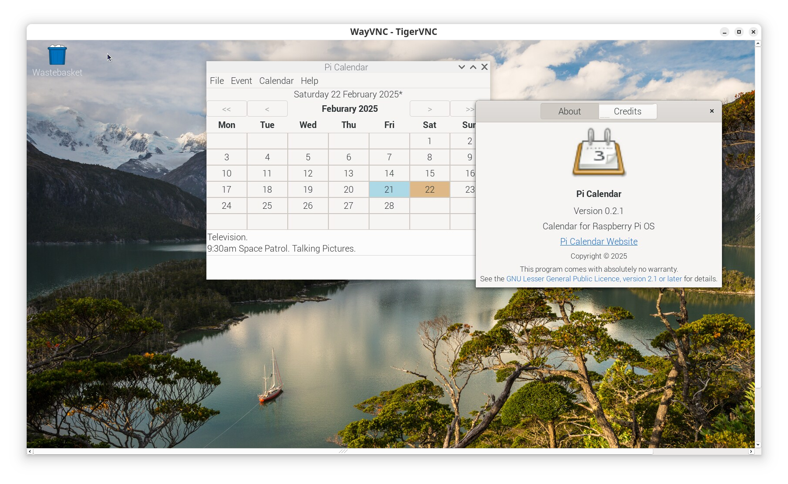
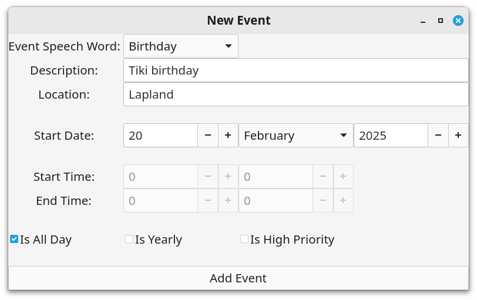
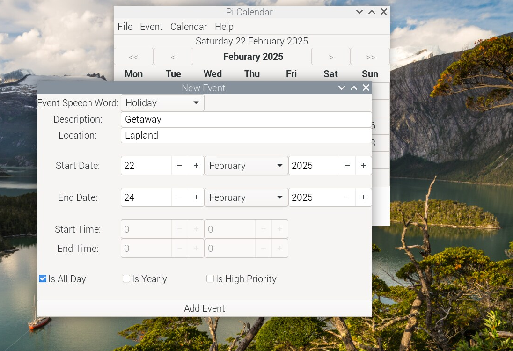
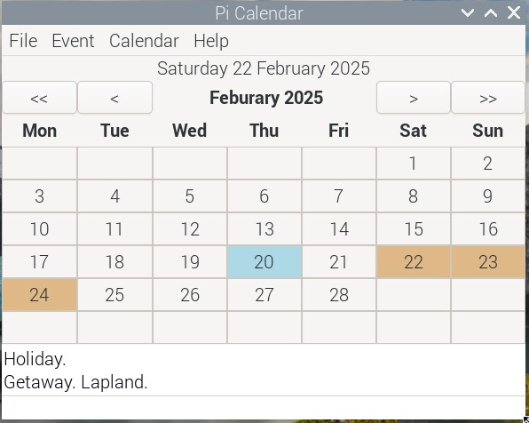
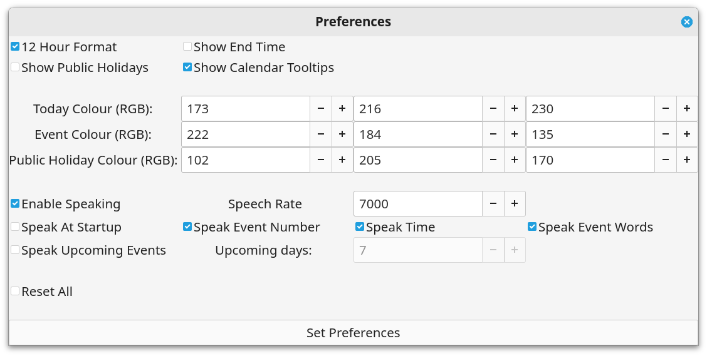
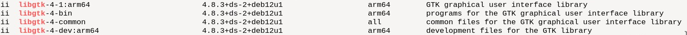

# Pi Calendar (Calendar for the Raspberry Pi)

Pi Calendar is a personal desktop calendar for use with [Raspberry Pi OS (64 bit)](https://www.raspberrypi.com/news/a-new-release-of-raspberry-pi-os/).  Raspberry Pi OS (64-bit) is a port of Debian Bookworm and can be used with both Raspberry Pi 4 and 5 single-board computers. It uses the Wayland compositor called [labwc](https://github.com/labwc/labwc) by default.

Pi Calendar has been developed using C and [GTK4](https://docs.gtk.org/gtk4/) and tested with both Raspberry Pi 4 and Raspberry Pi 500. Apart from  having standard calendar functionality, Pi Calendar has it own built-in speech engine for speaking dates, times and event words. Day events can be read out when the calendar is started as well as upcoming events. A screenshot of Pi Calendar is shown below.



## Core Features

* built with C and GTK 4.8.3 arm 64
* month-view calendar 
* event details, location, start and end time can be entered and edited
* multiday events displayed
* export and import iCalendar files (backup and restore)
* Sqlite3 database used to store events
* built-in word concatenation speech synthesizer (date, time and event word speaker)
* tested with Raspberry Pi 4 and Raspberry Pi 500.

### Prebuilt Binary

A 64-bit prebuilt binary for the latest version of Pi Calendar is available and can be downloaded from the binary directory. This has been built using GTK 4.8 and tested with Raspberry Pi OS (64-bit) on a Pi 4 and Pi 500. 

You first need to install the GTK 4 libraries from the terminal using the commands below.

```
sudo apt update
sudo apt upgrade
sudo apt install libgtk-4-dev
```

Then download and extract the Pi Calendar program (called picalendar found inside the binary folder) and store it where you place your applications in your home folder. For example, create a directory called "Software" in your home folder and then inside this a folder called "picalendar" e.g. ~/Software/picalendar. Copy the Pi Calendar executable and calendar.png image into this. Open the folder in the terminal and change the picalendar file permissions so that be run as an executable program using the command below.

```
sudo chmod +x picalendar
```

The Pi Calendar binary can be run from the terminal using:

```
./picalendar
```

### Create Menu Entry

To add Pi Calendar to the system menu modify the Pi Calendar desktop file provided in the download. A desktop file has a .desktop extension and provides metadata about an application such as its name, icon, command to execute and other properties. For user-specific applications desktop files can be located locally in the ***~/.local/share/applications/***  directory. Local user entries take precedence over system entries. 

The "org.gtk.picalendar.desktop" file is shown below where the user name is "pi" and the working directory is "/home/pi/Software/picalendar" You need to modify this using your own user name and directory locations. For example, the executable path would be "Exec=/home/your-user-name/Software/picalendar/picalendar". The Exec variable defines the command to execute when launching an application, in this case, the "picalendar" binary executable. The Icon variable specifies the path to the icon file associated with the application. In a .desktop file, you need to use absolute and full paths.

```
[Desktop Entry]
Version=0.2.1
Type=Application
Name=Pi Calendar
Comment=Calendar for Raspberry Pi
Icon=/home/pi/Software/picalendar/calendar.png
Exec=/home/pi/Software/picalendar/picalendar
X-GNOME-UsesNotifications=true
Categories=Calendar;Office;
MimeType=text/calendar;
```

Use the terminal to copy your modified  "org.gtk.speakingcalendar.desktop" file to ***~/.local/share/applications/***   using the terminal command below.

```
cp org.gtk.picalendar.desktop /home/pi/.local/share/applications
```

Note that this is a hidden directory and you need to tick the "Show Hidden Files" option in the file explorer to display it.

You can now run Pi Calendar from the system menu. It is located in the "Office Category". If you right click on the Pi Calendar menu entry you can use "Add to Launcher" to add it to the system taskbar. You can also use "Add to Desktop".

By default the calendar database (called calendar.db) is stored in the user home directory. Assuming that this is the case you can autostart Pi calendar at boot by copying the Pi Calendar desktop file to the user autostart directory as shown below..

```
cp org.gtk.picalendar.desktop /home/pi/.config/autostart
```

Again change "pi" for your user name. Create the autostart directory it does not already exist. To stop Pi Calendar starting at boot just delete the desktop file located in the autostart directory.

## Calendar Usage

If you have used a calendar application before then using Pi Calendar will be straight forward. 

### Adding New Event

* Click on the "New Event" button in the header bar or press Ctrl+n to invoke the "New Event" window
* Select the event speech word (summary) using the dropdown
* Enter the event description 
* Enter the location
* Enter the start date by setting the day, month and year values 
* Enter start and end times (or tick the all day check box)
* Times are entered as hour and minute values using the 24-hour time notation
* Events are sorted by start time when displayed
* Check the "Is Yearly" check box if the event repeats every year (e.g. birthdays and anniversaries)

A screenshot of the new event dialog is shown below.



A multiday event can be created and displayed on the calendar as shown below.





### Editing Existing Event

* Select the event in the list view and either select "Event->Edit Selected Event" from the menu or press Ctrl+e
* Change details as appropriate

### Searching For Events

* Select the Event->Search menu item
* Enter a search term or location.

### Preferences

* Select Calendar->Preferences from the menu or use Ctrl+Alt+p to invoke the preferences window (see screenshot below)
* Change options as required



You can use 12 hour format. Event end-times can also be shown in the list view. If notable dates is selected then the date label shows special calendar dates such as some UK public holidays. These are also spoken.

GTK [ColorDialogButton](https://docs.gtk.org/gtk4/class.ColorDialogButton.html) was introduced with GTK 4.10 and so is not availible with GTK 4.8 which is used by Raspberry Pi OS and Debian Bookworm. Instead colours have to be entered manually using RGB values.You can use the w3Schools [RGB calcuator](https://www.w3schools.com/colors/colors_rgb.asp) for selecting a RGB colour.

## Talking

* Press spacebar to speak event details.

### Information

* Select "Help->Information from the menu or press F1

* the information window shows the keyboard shoutcuts, how many records are in the database, the Sqlite version being used on the system, checks if espeak installed, the desktop font and scale factor.

* Use the About dialog to display current version.

### Keyboard Shortcuts

```
Ctrl+n            New Event
Ctrl+e            Edit Selected Event
Delete            Delete Selected Event
Ctrl_Alt+p        Preferences window
Spacebar        Speak
t            Speak Time
F1            Information
```

### Events Database

Events are stored in an [Sqlite](https://www.sqlite.org/index.html) database. SQLite is a small, fast and full-featured SQL database engine written in C. 

### Backup Restore Events Database

Pi Calendar allows a personal calendar to be exported as an iCalendar file. These typically use the file extension ".ical" or ".ics". The [iCalendar standard](https://icalendar.org/) is an open standard for exchanging calendar and scheduling information between users and computers.  An icalendar file is a plain text file and so can be modified using a standard text editor. 

The export to icalendar file does not currently support time zones and so the DTSTART and DTEND properties contain dates with local time and have no reference to a time zone. For example, the following represents an event starting on January, 1st, 2024 at 11.30am and ending at 2pm.

```
DTSTART:20240101T113000
DTEND:20240101T140000
```

You should backup your events by using the File->Export menu item which will create an "events.ical" file in the working directory (keep this safe and make another copy if necessary). If you then corrupt your database, you can clear all events from the Sqlite database and then use the File->Import to restore exported events. This assumes that the "events.ical" file is in the current working directory. If you completely corrupt your Sqlite database called calendar.db then rename it and restart Pi Calendar which will create a new empty database and restore into this. 

The parser will be updated with new features in future releases.

## Build From Source

The C source code for the Pi Calendar application is provided in the src (source) directory.

You need the GTK4 development libraries and the gcc compiler to build Pi Calendar. Install the following packages .

```
sudo apt install build-essential
sudo apt install libgtk-4-dev
sudo apt install libasound2-dev
```

The packages:

```
sudo apt install libglib2.0-dev
sudo apt install alsa-utils
```

are needed but should be installed by default. 

The code has been compiled using GTK 4.8.3 amd64. To determine which version of GTK4 is running on a Linux system use the following terminal command.

```
dpkg -l | grep libgtk*
```



To build Pi Calendar you also need the Sqlite3 development libraries. You need to install the following packages.

```
sudo apt install sqlite3
sudo apt install libsqlite3-dev
```

To check the installed Sqlite version use the command below.

```
sqlite3 --version
```

Use the MAKEFILE to compile Pi Calendar. Just run "make" inside the source code folder.

```
make
```

To run Pi Calendar from the terminal use

```
./picalendar
```

The binary version of Pi Calendar provided in the download has been compiled with Raspberry Pi OS (64-bit) using the default Wayland compositor [labwc](https://github.com/labwc/labwc) version 0.8.1. To determine the current version of labwc use the command below.

```
labwc --version
```

[Geany](https://www.geany.org/) can be used as a source code editor for opening, viewing and then compiling the Pi Calendar C code. Geany is lightweight and has an integrated terminal for building the application.

## Speech Synthesis

Pi Calendar incorporates a small word-based speech synthesizer used to concatenate and play-back pre-recorded English words using the computer speaker. The voice used by this version of Pi Calendar is based on my own recordings and so is subject to same license as the project. Words are recorded in a headless RAW audio format so that they can be converted to hexadecimal values and stored in an array and added to a voice header file. The voice will be improved and updated in future versions of the project.

For speech synthesis I explored the possibility of installing and using [eSpeak](https://espeak.sourceforge.net/) so that commands could be send to it for speech output.  However, I discovered a potential eSpeak license compatibility issue in that some of its components may not be compatible with the GTK LGPL v2.1 license. For example, the IEEE80.c file [license](https://github.com/espeak-ng/espeak-ng/blob/c1d9341f86eee4b7a0da50712b627d8a76e92fea/src/libespeak-ng/ieee80.c) says "Copyright (C) 1989-1991 Apple Computer, Inc." which is very strange given that espeak has a GPL v3 [license](https://espeak.sourceforge.net/license.html). This is discussed further in the forum post [here](https://opensource.stackexchange.com/questions/11545/possibilities-to-use-a-gpl-v3-licensed-library-in-a-closed-source-game). Consequently, I decided not to use eSpeak.

## Versioning

[SemVer](http://semver.org/) is used for versioning. The version number has the form 0.0.0 representing major, minor and bug fix changes.

## Author

* **Alan Crispin** [Github](https://github.com/crispinprojects)

## Project Status

Active.

Pi Calendar is a port of my Talk Calendar project for Linux which can be found [here](https://github.com/crispinprojects/talkcalendar).

## License

GTK is released under the terms of the [GNU Lesser General Public License version 2.1](https://www.gnu.org/licenses/old-licenses/lgpl-2.1.html). Consequenty, Pi Calendar is licensed under the same LGPL v2.1 license.

## Acknowledgements

* [Raspberry Pi Foundation](https://www.raspberrypi.org/)

* [Debian](https://www.debian.org/)

* [Talk Calendar](https://github.com/crispinprojects/talkcalendar)

* [GTK](https://www.gtk.org/)

* GTK is a free and open-source project maintained by GNOME and an active community of contributors. GTK is released under the terms of the [GNU Lesser General Public License version 2.1](https://www.gnu.org/licenses/old-licenses/lgpl-2.1.html).

* [GTK4 API](https://docs.gtk.org/gtk4/index.html)

* [GObject API](https://docs.gtk.org/gobject/index.html)

* [Glib API](https://docs.gtk.org/glib/index.html)

* [Gio API](https://docs.gtk.org/gio/index.html)

* [Geany](https://www.geany.org/) is a lightweight source-code editor (version 2 now uses GTK3). [GPL v2 license](https://www.gnu.org/licenses/old-licenses/gpl-2.0.txt)

* [Sqlite](https://www.sqlite.org/index.html) is open source and in the [public domain](https://www.sqlite.org/copyright.html).
