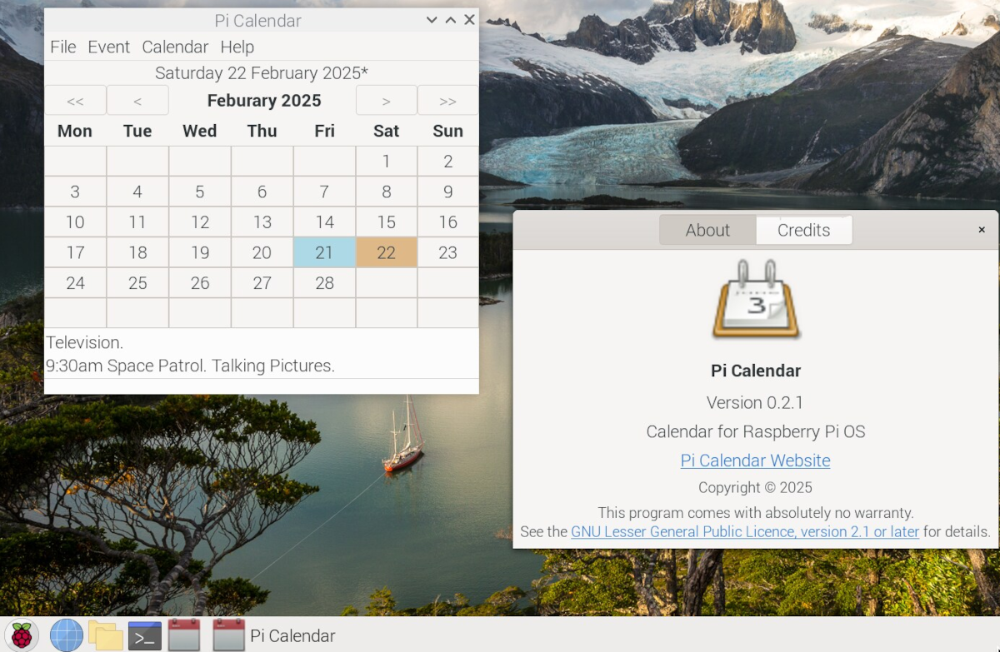
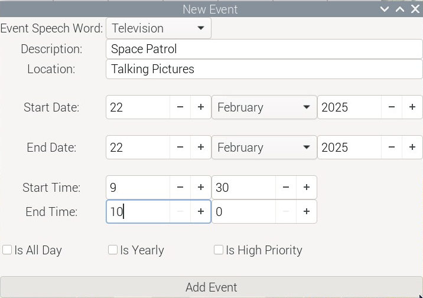
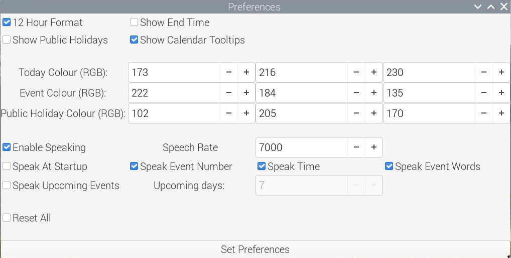

# Pi Calendar (Raspberry Pi OS)

Pi Calendar is a personal desktop calendar for use with Raspberry Pi OS (64 bit). It has some speech capability using its own built-in speech engine for speaking dates, times and event words. Raspberry Pi OS (64 bit) is a port of Debian Bookworm for Raspberry Pi desktops and now uses the Wayland compositor called [labwc](https://www.raspberrypi.com/news/a-new-release-of-raspberry-pi-os/) by default. 

Pi Calendar has been developed using C and [GTK4](https://docs.gtk.org/gtk4/). The speech synthesizer is based on concatenating and playing back pre-recorded English words. A screenshot of Pi Calendar is shown below.



## Core Features

* built with C and GTK 4.8.3 arm 64
* month-view calendar 
* event details, location, start and end time can be entered and edited
* export and import iCalendar files (backup and restore)
* Sqlite3 database used to store events
* built-in word concatenation speech synthesizer (date, time and event word speaker)
* tested with Raspberry Pi 4

### Prebuilt Binary

A 64-bit prebuilt binary for the latest version of Pi Calendar is available and can be downloaded from the binary directory. This has been built using GTK 4.8 and tested with Raspberry Pi OS (64-bit) on a Pi 4. 

Extract the downloaded file which contains the picalendar executable. Assuming that the GTK4 base libraries are installed the Pi Calendar binary can be run from the terminal using:

```
./picalendar
```

or double click on the "picalendar" file. Pi Calendar must have executable permissions to execute. If it does not then right click on the Pi Calendar binary file and choose Properties->Permissions and tick allow "Executable as Program".

### Create App Menu Launcher

You can create a Pi Calendar launcher so that it can be run from the application menu.

First create a directory in your home folder for the Pi Calendar application. For example, create a directory called "Software" in your home folder and then inside this a folder called "picalendar" e.g. ~/Software/picalendar. Copy the Pi Calendar executable and calendar.png image into this.

Now launch the Main Menu Editor using "Preferences->Main Menu Editor" and create a new item as shown in the example below.


You can now run Pi Calendar from the system menu. You can also add the Pi Calendar launcher to the taskbar (launcher) or desktop by right clicking on it from within the Main Menu Editor. The calendar database will be stored in your home directory if using this approach.

## Calendar Usage

If you have used a calendar application before then using Pi Calendar will be straight forward. 

### Adding New Event

* Click on the "New Event" button in the header bar or press Ctrl+n to invoke the "New Event" window
* Select the event speech word (summary) using the dropdown
* Enter the event description 
* Enter the location
* Enter the start date by setting the day, month and year values 
* Enter start and end times (or tick the all day check box)
* Times are entered as hour and minute values using the 24-hour time notation
* Events are sorted by start time when displayed
* Check the "Is Yearly" check box if the event repeats every year (e.g. birthdays and anniversaries)

A screenshot of the new event dialog is shown below.



### Editing Existing Event

* Select the event in the list view and either select "Event->Edit Selected Event" from the menu or press Ctrl+e
* Change details as appropriate

### Searching For Events

* Select the Event->Search menu item
* Enter a search term or location.

### Preferences

* Select Calendar->Preferences from the menu or use Ctrl+Alt+p to invoke the preferences window (see screenshot below)
* Change options as required



You can use 12 hour format. Event end-times can also be shown in the list view. If notable dates is selected then the date label shows special calendar dates such as some UK public holidays. These are also spoken.

GTK [ColorDialogButton](https://docs.gtk.org/gtk4/class.ColorDialogButton.html) was introduced with GTK 4.10 and so is not availible with GTK 4.8 which is used by Raspberry Pi OS and Debian Bookworm. Instead colours have to be entered manually using RGB values.You can use the w3Schools [RGB calcuator](https://www.w3schools.com/colors/colors_rgb.asp) for selecting a RGB colour.

## Talking

* Press spacebar to speak event details.

### Information

* Select "Help->Information from the menu or press F1

* the information window shows the keyboard shoutcuts, how many records are in the database, the Sqlite version being used on the system, checks if espeak installed, the desktop font and scale factor.

* Use the About dialog to display current version.

### Keyboard Shortcuts

```
Ctrl+n            New Event
Ctrl+e            Edit Selected Event
Delete            Delete Selected Event
Ctrl_Alt+p        Preferences window
Spacebar        Speak
t            Speak Time
F1            Information
```

### Events Database

Events are stored in an [Sqlite](https://www.sqlite.org/index.html) database. SQLite is a small, fast and full-featured SQL database engine written in C. 

### Backup Restore Events Database

Pi Calendar allows a personal calendar to be exported as an iCalendar file. These typically use the file extension ".ical" or ".ics". The [iCalendar standard](https://icalendar.org/) is an open standard for exchanging calendar and scheduling information between users and computers.  An icalendar file is a plain text file and so can be modified using a standard text editor. 

The export to icalendar file does not currently support time zones and so the DTSTART and DTEND properties contain dates with local time and have no reference to a time zone. For example, the following represents an event starting on January, 1st, 2024 at 11.30am and ending at 2pm.

```
DTSTART:20240101T113000
DTEND:20240101T140000
```

You should backup your events by using the File->Export menu item which will create an "events.ical" file in the working directory (keep this safe and make another copy if necessary). If you then corrupt your database, you can clear all events from the Sqlite database and then use the File->Import to restore exported events. This assumes that the "events.ical" file is in the current working directory. If you completely corrupt your Sqlite database called calendar.db then rename it and restart Pi Calendar which will create a new empty database and restore into this. 

The parser will be updated with new features in future releases.

## Build From Source

The C source code for the Pi Calendar application is provided in the src directory.

[Geany](https://www.geany.org/) can be used as a source code editor for opening, viewing and then compiling the Pi Calendar C code. Geany is lightweight and has an integrated terminal for building the application.

You need the GTK4 development libraries and the gcc compiler. The code has been compiled using GTK 4.8.3 amd64 (Debian 12). To determine which version of GTK4 is running on a Linux system use the following terminal command.

```
dpkg -l | grep libgtk*
```


To build Pi Calendar you also need the Sqlite3 development libraries. With Debian and Ubuntu you install these using the commands below.

```
sudo apt install sqlite3
sudo apt install libsqlite3-dev
```

To check the installed version use the command below.

```
sqlite3 --version
```

With both Raspbeery Pi OS (and Debian Bookworm) you need to install the following packages to compile Pi Calendar.

```
apt install build-essential
apt install libgtk-4-dev
apt install libasound2-dev
```

The packages:

```
apt install libglib2.0-dev
apt install alsa-utils
```

are needed but should be installed by default. If using the binary you need to ensure that the package libgtk-4-1 is installed

```
sudo apt install libgtk-4-1
```

Use the MAKEFILE to compile. 

```
make
```

To run Pi Calendar from the terminal use

```
./picalendar
```

## Speech Synthesis

Pi Calendar incorporates a small word-based speech synthesizer used to concatenate and play-back pre-recorded English words using the computer speaker. The voice used by this version of Pi Calendar is based on my own recordings and so is subject to same license as the project. Words are recorded in a headless RAW audio format so that they can be converted to hexadecimal values and stored in an array and added to a voice header file. The voice will be improved and updated in future versions of the project.

For speech synthesis I explored the possibility of installing and using [eSpeak](https://espeak.sourceforge.net/) so that commands could be send to it for speech output.  However, I discovered a potential eSpeak license compatibility issue in that some of its components may not be compatible with the GTK LGPL v2.1 license. For example, the IEEE80.c file [license](https://github.com/espeak-ng/espeak-ng/blob/c1d9341f86eee4b7a0da50712b627d8a76e92fea/src/libespeak-ng/ieee80.c) says "Copyright (C) 1989-1991 Apple Computer, Inc." which is very strange given that espeak has a GPL v3 [license](https://espeak.sourceforge.net/license.html). This is discussed further in the forum post [here](https://opensource.stackexchange.com/questions/11545/possibilities-to-use-a-gpl-v3-licensed-library-in-a-closed-source-game). Consequently, I decided not to use eSpeak.

## Versioning

[SemVer](http://semver.org/) is used for versioning. The version number has the form 0.0.0 representing major, minor and bug fix changes.

## Author

* **Alan Crispin** [Github](https://github.com/crispinprojects)

## Project Status

Active.

Pi Calendar is a port of my Talk Calendar project for Linux which can be found [here](https://github.com/crispinprojects/talkcalendar).

## License

GTK is released under the terms of the [GNU Lesser General Public License version 2.1](https://www.gnu.org/licenses/old-licenses/lgpl-2.1.html). Consequenty, Pi Calendar is licensed under the same LGPL v2.1 license.

## Acknowledgements

* [Raspberry Pi Foundation](https://www.raspberrypi.org/)

* [Debian](https://www.debian.org/)

* [Talk Calendar](https://github.com/crispinprojects/talkcalendar)

* [GTK](https://www.gtk.org/)

* GTK is a free and open-source project maintained by GNOME and an active community of contributors. GTK is released under the terms of the [GNU Lesser General Public License version 2.1](https://www.gnu.org/licenses/old-licenses/lgpl-2.1.html).

* [GTK4 API](https://docs.gtk.org/gtk4/index.html)

* [GObject API](https://docs.gtk.org/gobject/index.html)

* [Glib API](https://docs.gtk.org/glib/index.html)

* [Gio API](https://docs.gtk.org/gio/index.html)

* [Geany](https://www.geany.org/) is a lightweight source-code editor (version 2 now uses GTK3). [GPL v2 license](https://www.gnu.org/licenses/old-licenses/gpl-2.0.txt)

* [Sqlite](https://www.sqlite.org/index.html) is open source and in the [public domain](https://www.sqlite.org/copyright.html).
